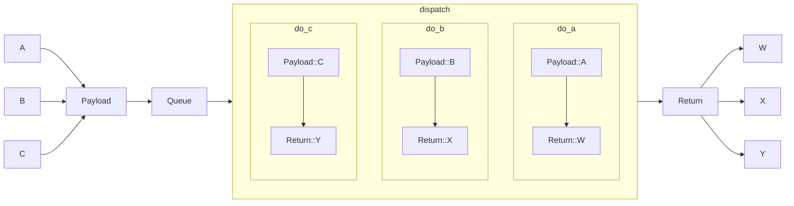
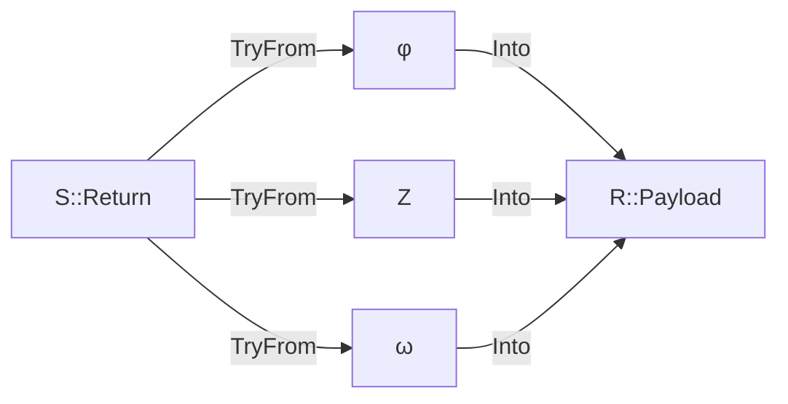

# Issues with return-to-mailbox

## Setup

A `Role`, `R`, is an interface for an actor, that promises the actor has some number of message handlers:

```rust
fn do_A(&mut self, A) -> W;
fn do_B(&mut self, B) -> X;
fn do_C(&mut self, C) -> Y;
```

An actor that implements the Role, and so contains the accompanying handlers, is correspondingly instantiated via a `Arc<dyn R>`. However, the actor can only have a single event loop and each `Role` has a single message queue. To address this, the `Role` has two associated enums, `Payload` and `Return`:

```rust
enum Payload {
    A, B, C
}
enum Return {
    W, X, Y
}
```

The flow through the event loop then looks like:



In order to allow the caller to decide what to do with the `Return` value that will eventually be produced, submitting a message to `R` returns a `Envelope<R>`. This is conceptually a `Future<Return>`, but since we know a method's return type at the point we produce the `Envelope`, this can be tracked with an extra generic parameter to improve ergonomics. This means that the caller's interface to the actor ends up looking like:

```rust
fn submit_A(&mut self, A) -> Envelope<R, W>;
fn submit_B(&mut self, B) -> Envelope<R, X>;
fn submit_C(&mut self, C) -> Envelope<R, Y>;
```

So that generated code can be more uniform, we also implement `From<A> for Payload`, etc, and correspondingly `TryFrom<Return> for W` - this conversion may fail only because our `Return` instance is not actually a `W` variant. There is a possibility in the former case that two different methods take the same arguments, and so this conversion would be ambiguous in regard to which method we are trying to invoke. In this situation, there is no `From` implementation. However, in the reverse case, we do not need to retain which method produced a value of a given type, so there is no ambiguity - only a need to check for multiple possible variants - and we always have a `TryFrom`.

## Return Paths

Since this is a fundamentally asynchronous operation, the caller is long gone by the time the `Return` value is produced. To work around this, there is a `ReturnPath<Return>` value included in the message queue alongside the `Payload` which defines what to do with the value. This has two main variants:

* Drop the value immediately - this is used to optimize certain patterns like attaching streams to the actor where there is no awaiting caller.
* Use an included `oneshot::Sender` to send the value to an awaiter. The corresponding `Receiver` of this channel was handed out synchronously inside the `Envelope` and is what allows the `Envelope` to act as a `Future<Return>`. (Machinery inside the `Envelope<Return, V>` then calls `V::try_from(return)` when the value is received.)

```rust
enum ReturnPath<ReturnType> {
    Drop,
    Immediate(Sender<ReturnType>)
    Mailbox(???)
}
```

However, a third mode would be helpful - having the `ReturnPath` point directly to another actor's message queue. However, actually expressing this runs into a number of problems.

Firstly, ordinarily, as an actor of role `R` is instantiated by a `Arc<dyn R>`, there was no way to convert this into a reference to an actor of dynamically determined role. This means that we cannot put a reference to the actor into a `ReturnPath` without a choice of `R`, but then `R` is not meaningful for the variants that don't involve an actor. Each actor's mailbox would also have to pick a single value for `R` in order to instantiate the underlying `Queue<(Payload, ReturnPath<Payload, R>)>` for their mailbox, and this isn't possible.

To work around this, a new trait, `ReceiverRole<Payload>` allows an actor to be represented as receiving a message of type `Payload` with no return value, with no further information. We can then have `ReturnPath::Mailbox` contain a `Arc<ReceiverRole<ReturnType>>`.

While this appears closer to a solution, there is still a subtle problem - no role `R` can be defined that accepts a `S::Return` as its own `R::Payload` from some other role `S`, because these are both bespoke types - with different names even if the structures happen to be identical - so we can't actually get a `Arc<ReceiverRole<S::Return>>`. We can't even be generic over a Role such that `R::Payload` implements `From<S::Return>` because these are currently not generated - what we're actually wanting is a *third* type `Z` where `R::Payload : From<Z>` and `Z: TryFrom<S::Return>`.

If it is possible to find *any* `Z` that fulfils this condition, then it must be unique for this construction to make sense.  It's also far from obvious the relations `Z` must have with `S::Return` and `R::Payload` for this construction to actually be a surjection from `S::Return` values to `R::Payload` values.

Unfortunately, no part of the type system can assert uniqueness, so we cannot globally rule out a situation like the following:



However, we can use the same trick as earlier with `Envelope` - if we have a *candidate* `Z`, then we can assert the trait implementations exist, and if they do (particularly `From<Z> for R::Payload`), the conversion is unambiguous by design.

So to make this work, we must somehow communicate the choice of `Z` (suitably constrained) and subsequently the choice of `TryFrom` implementation, down to S's `ReturnPath` type, *without* introducing any type parameters other than the `S::Return` that is already provided.

One potential solution is found in noticing that composing the two conversions together *always* produces a function `S::Return -> R::Payload`, effectively sweeping away the choice of `Z` into the choice of which function exactly is being constructed. A pointer to this function could then be passed down into the `ReturnPath`. However, this unfortunately re-introduces `R` in the context of the `ReturnPath` which was what we were trying to avoid.

Answers on a postcard?
